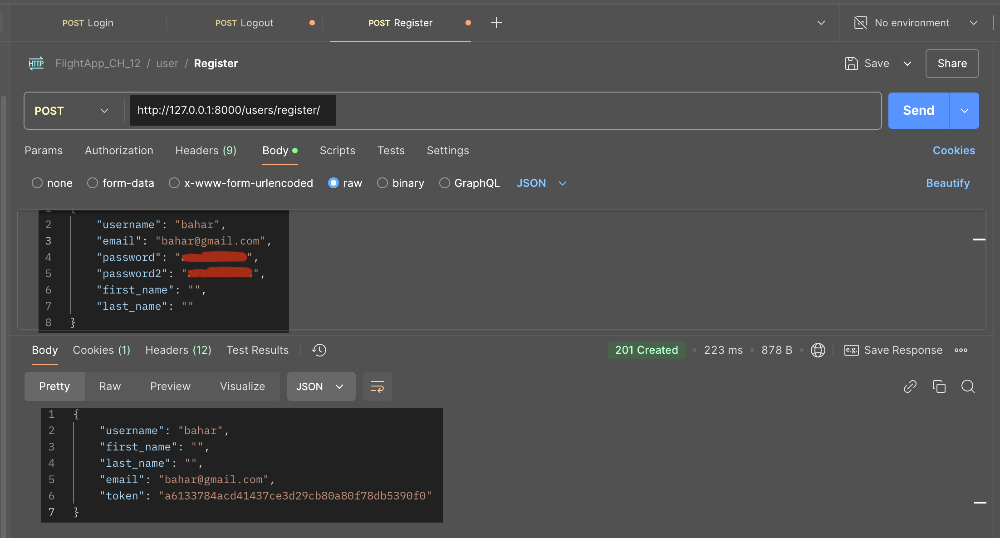
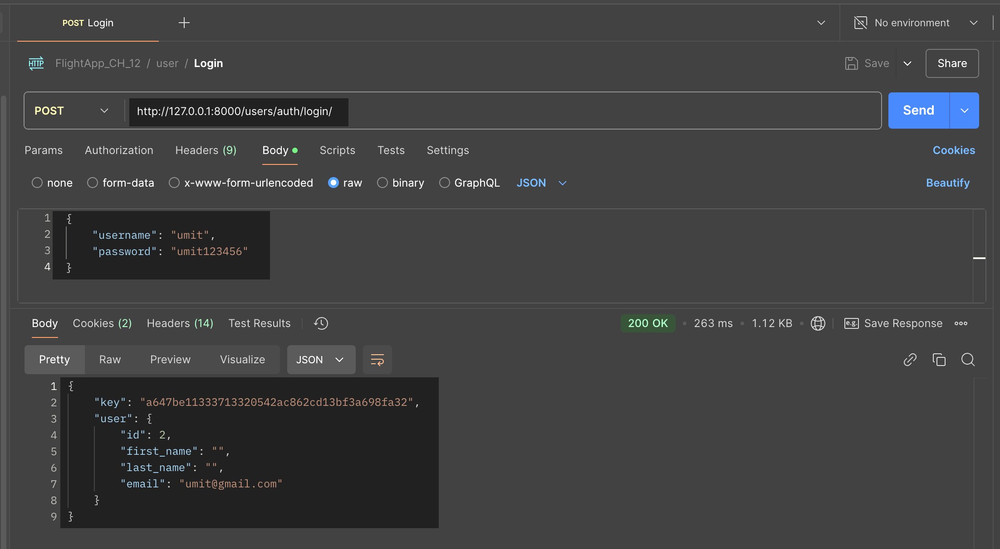

<!-- Please update value in the {}  -->

<h1 align="center">Project_Django_Template_Blog_App</h1>


<div align="center">
  <h3>
    <a href="https://umit8112.pythonanywhere.com/">
      Demo
    </a>
     | 
    <a href="https://umit8112.pythonanywhere.com/">
      Project
    </a>
 
  </h3>
</div>

<!-- TABLE OF CONTENTS -->

## Table of Contents

- [Table of Contents](#table-of-contents)
- [Overview](#overview)
- [Built With](#built-with)
- [How To Use](#how-to-use)
- [Acknowledgements](#acknowledgements)
- [Contact](#contact)

<!-- OVERVIEW -->

## Overview


---


---



---



---


---


---


---


## Built With

<!-- This section should list any major frameworks that you built your project using. Here are a few examples.-->

- HTML
- Bootstrap4
- JS
- Django Templates

## How To Use

<!-- This is an example, please update according to your application -->

To clone and run this application, you'll need [Git](https://github.com/Umit8098/Proj_Django_Temp_Blog_App_CH-8) 
```bash
# Clone this repository
$ git clone https://github.com/Umit8098/Proj_Django_Temp_Blog_App_CH-8.git

# Install dependencies
    $ python -m venv env
    > env/Scripts/activate (for win OS)
    $ source env/bin/activate (for macOs/linux OS)
    $ pip install -r requirements.txt
# Edit .backend.env to .env
# Add SECRET_KEY in .env file

# Run the app
    $ python manage.py runserver
```

## Acknowledgements
- Information for your projects
- This is a blogging application.
- Users can view posts anonymously.
- If they want to create a post, comment on the post, or like the post, they must register and log in to the application. After registering, they can update the profile information created for them.
- Users can perform CRUD (Create-Read-Update_Delete) operations.
- The user is notified of the actions taken by a message that appears and disappears on the screen.
- If they have forgotten their login password, an e-mail will be sent to their registered e-mail address so that they can create a login password.
- They can also change their login passwords if they wish.
- Like, view and comment statistics of all posts are displayed.

<hr>

- Bu bir blog uygulamasıdır.
- Kullanıcılar anonim olarak gönderileri görüntüleyebilirler.
- Gönderi oluşturmak, gönderiye yorum yazmak, gönderiyi beğenmek isterlerse uygulamaya kayıt olup giriş yapmaları gerekir. Kayıt olduktan sonra kendileri için oluşturulan profil bildilerini güncelleyebiliriler.
- Kullanıcılar CRUD (Create-Read-Update_Delete) işlemleri yapabilir.
- Yaptığı işlemler ekranda belirip kaybolan bir mesajla kullanıcıya bildirilir.
- Eğer giriş şifrelerini unutmuşlarsa, kayıtlı e posta adreslerine giriş şifresi oluşturabilmeleri için posta gönderilir.
- Ayrıca isterlerse giriş şifrelerini değiştirebilirler.
- Tüm gönderilerin beğeni, görüntülenme, yorum istatiktikleri görüntülenmektedir. 

## Contact

<!-- - Website [your-website.com](https://{your-web-site-link}) -->
- GitHub [@Umit8098](https://github.com/Umit8098)

- Linkedin [@umit-arat](https://linkedin.com/in/umit-arat/)
<!-- - Twitter [@your-twitter](https://{twitter.com/your-username}) -->
