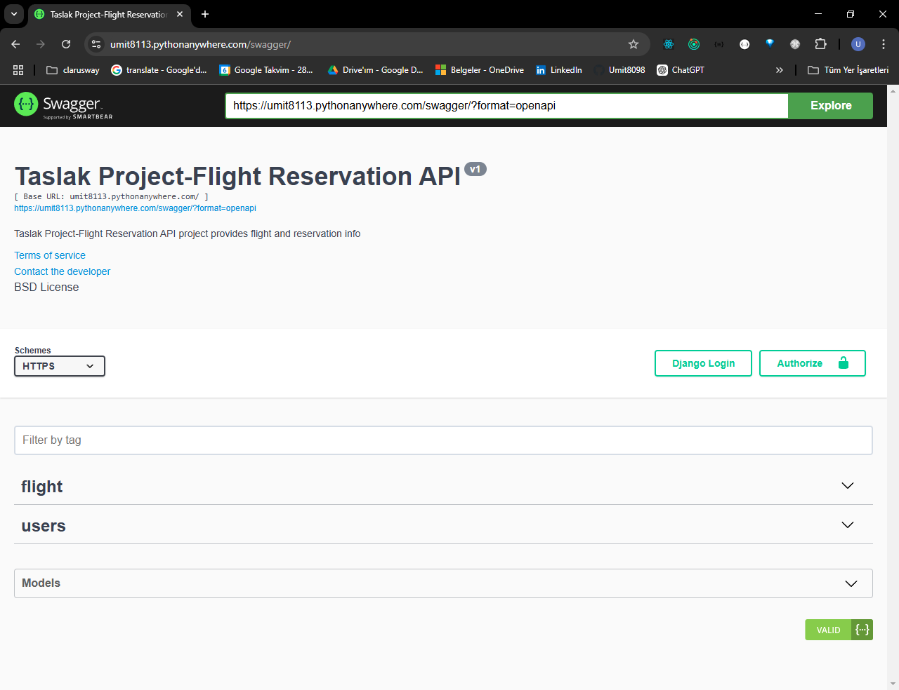
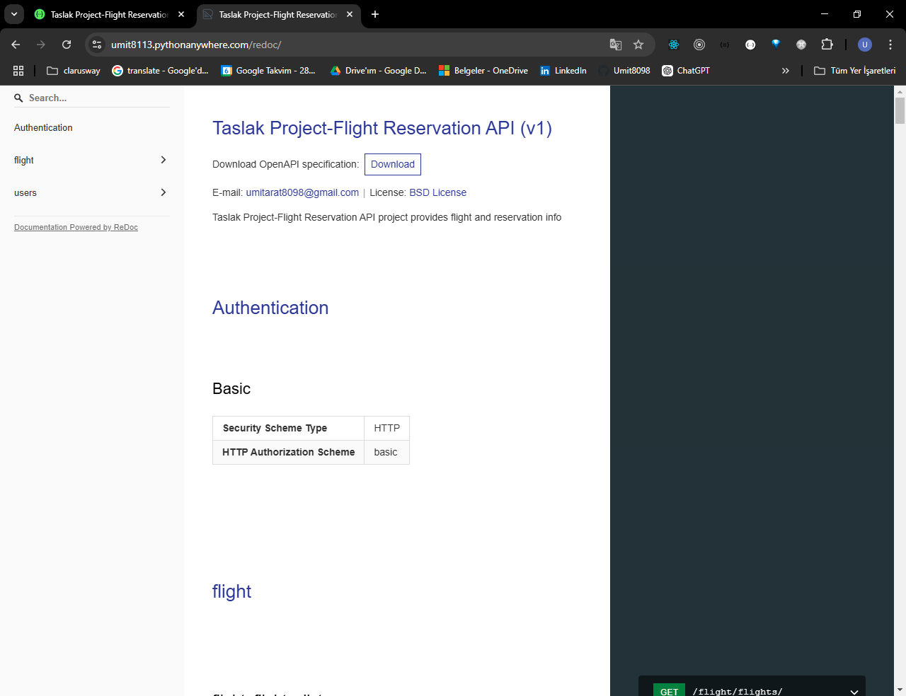
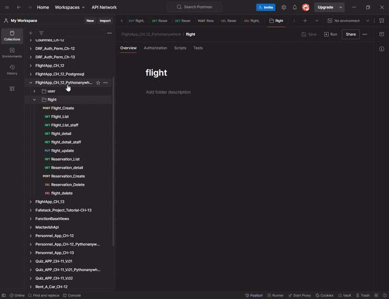

<!-- Please update value in the {}  -->

<h1 align="center">Project_Django_Rest_Framework_Flight_App</h1>

<p align="center"><strong>✈️ A modern flight booking system API
 ✈️</strong></p>

<!-- <div align="center">
  <h3>
    <a href="https://github.com/Umit8098/Project_Django_Rest_Framework_Flight_App_CH-12">
      Demo
    </a>
     | 
    <a href="https://umit8113.pythonanywhere.com/">
      Project
    </a>
 
  </h3>
</div> -->

<!-- TABLE OF CONTENTS -->

## Table of Contents

- [Table of Contents](#table-of-contents)
- [API Documentation](#api-documentation)
- [API Testing](#api-testing)
- [Overview](#overview)
- [Built With](#built-with)
- [How To Use](#how-to-use)
- [About This Project](#about-this-project)
- [Acknowledgements](#acknowledgements)
- [Key Features](#key-features)
- [Contact](#contact)


## API Documentation

Projenin detaylı API dokümantasyonlarına aşağıdaki linklerden ulaşabilirsiniz:

- [Swagger Dokümantasyonu](https://umit8113.pythonanywhere.com/swagger/)
- "Swagger Dokümantasyonu Görseli": API endpoint'lerini kolayca test etmenizi sağlayan bir arayüz.
<!--  -->

➡ API endpoint'lerini kolayca test etmenizi sağlayan arayüz.

  
- [RedocDokümantasyonu](https://umit8113.pythonanywhere.com/redoc/)
- "Redoc Dokümantasyonu Görseli": API yapısını detaylı ve düzenli bir şekilde sunan bir dokümantasyon aracı.
<!--  -->

➡ API yapısını detaylı ve düzenli bir şekilde sunan dokümantasyon aracı.


<!-- - Bu dokümantasyonlar sayesinde API endpoint'lerini kolayca test edebilir ve yapılarını inceleyebilirsiniz. -->
**Not:** Swagger ve Redoc dokümantasyonlarına herhangi bir kullanıcı girişi yapmadan erişebilirsiniz.

- Swagger ve Redoc dokümantasyonlarıyla birlikte, API'leri test etmek için Postman koleksiyonumuzu kullanabilirsiniz. [Flight Reservation API Postman Collection](https://umit-dev.postman.co/workspace/Team-Workspace~7e9925db-bf34-4ab9-802e-6deb333b7a46/collection/17531143-5c497d31-9dd6-44f2-930c-8f4337595920?action=share&creator=17531143)

## API Testing

To test APIs via Postman, you can follow the steps below:
1. Install Postman (if not installed): [Postman İndir](https://www.postman.com/downloads/).
2. This [Postman Collection](https://umit-dev.postman.co/workspace/Team-Workspace~7e9925db-bf34-4ab9-802e-6deb333b7a46/collection/17531143-5c497d31-9dd6-44f2-930c-8f4337595920?action=share&creator=17531143) Download and import.
3. Start testing APIs via Postman.

**Postman Collection Link:**  
[Flight Reservation API Postman Collection](https://umit-dev.postman.co/workspace/Team-Workspace~7e9925db-bf34-4ab9-802e-6deb333b7a46/collection/17531143-5c497d31-9dd6-44f2-930c-8f4337595920?action=share&creator=17531143)


## Overview

Flight Reservation App is a modern API solution through which users can manage flight reservations. Main features:
- **Flight Management:** staff users can add, update and delete flights.
- **Reservation Management:** staff users can view all reservations, users can manage their own reservations.
- **Anonymous Access:** Unregistered users can only view future flights.
- **Advanced User Authorization:** Users have the ability to change passwords and manage their own booking processes.
- **API Documentation with Swagger and Redoc:** Ability to examine and test the API structure in detail.
- **PostgreSQL Support:** Powerful and reliable database support in the Production environment.

---

Flight Reservation App, kullanıcıların uçuş rezervasyonlarını yönetebileceği modern bir API çözümüdür. Başlıca özellikler:
- **Uçuş Yönetimi:** staff kullanıcılar uçuşları ekleyebilir, güncelleyebilir ve silebilir.
- **Rezervasyon Yönetimi:** staff kullanıcılar tüm rezervasyonları görüntüleyebilir, kullanıcılar kendi rezervasyonlarını yönetebilir.
- **Anonim Erişim:** Kayıtlı olmayan kullanıcılar sadece gelecekteki uçuşları görüntüleyebilir.
- **Gelişmiş Kullanıcı Yetkilendirme:** Kullanıcılar şifre değiştirme ve kendi rezervasyon işlemlerini yönetme yeteneğine sahiptir.
- **Swagger ve Redoc ile API Dokümantasyonu:** API yapısını detaylı inceleme ve test etme olanağı.
- **PostgreSQL Desteği:** Production ortamında güçlü ve güvenilir veritabanı desteği.


- Project Swagger and Redoc Documentation Visual 
<!--  -->

➡ Interface that allows you to easily test API endpoints.

---

- user/authentication app testing on Postman
<!--  -->

➡ User registration process screen.

---
- Flight app testing on Postman
<!--  -->

➡ Flight booking test with Postman.

---
- user/authentication app testing on Postman
<!--  -->


---
- user/authentication app testing on Postman
<!--  -->


---
- user/authentication app testing on Postman
<!--  -->


---
- user/authentication app testing on Postman
<!--  -->


---

<!-- - API dokümantasyonları Swagger ve Redoc ile detaylandırılmıştır. İlgili linklere <a href="https://umit8113.pythonanywhere.com/swagger/" target="_blank">Swagger</a> ve <a href="https://umit8113.pythonanywhere.com/redoc/" target="_blank">Redoc</a> üzerinden ulaşabilirsiniz. -->

- API documentation is detailed with Swagger and Redoc. You can access the relevant links via [Swagger](https://umit8113.pythonanywhere.com/swagger/) and [Redoc](https://umit8113.pythonanywhere.com/redoc/).


- Flight Reservation App is a modern backend application developed to enable users to manage flight reservations and provide easy integration with API documentation.
- Provides CRUD operations specific to users and staff roles.
- Swagger and Redoc were used for API documentation.


## Built With

<!-- This section should list any major frameworks that you built your project using. Here are a few examples.-->

- Djago Rest Framework
- Swagger
- Debug Toolbar
- Logging
- Redoc
- PostgreSQL

## How To Use

<!-- This is an example, please update according to your application -->

- For online demo: [Swagger](https://umit8113.pythonanywhere.com/swagger/) veya [Redoc](https://umit8113.pythonanywhere.com/redoc/) arayüzlerine göz atabilirsiniz.

- To clone and run this application, you'll need [Git](https://github.com/Umit8098/Project_Django_Rest_Framework_Flight_App_CH-12.git) 

- When installing the required packages in the requirements.txt file, review the package differences for windows/macOS/Linux environments. 

- Complete the installation by uncommenting the appropriate package.

---

- Çevrimiçi demo için: [Swagger](https://umit8113.pythonanywhere.com/swagger/) veya [Redoc](https://umit8113.pythonanywhere.com/redoc/) arayüzlerine göz atabilirsiniz.

- requirements.txt dosyasındaki gerekli paketlerin kurulumu esnasında windows/macOS/Linux ortamları için paket farklılıklarını inceleyin. 

- Uygun olan paketi yorumdan kurtararak kurulumu gerçekleştirin. 

```bash
# Clone this repository
$ git clone https://github.com/Umit8098/Project_Django_Rest_Framework_Flight_App_CH-12.git

# Install dependencies
    $ python -m venv env
    $ python3.9 -m venv env (for macOs/linux OS)
    $ env/Scripts/activate (for win OS)
    $ source env/bin/activate (for macOs/linux OS)
    $ pip install -r requirements.txt
    $ python manage.py migrate (for win OS)
    $ python3 manage.py migrate (for macOs/linux OS)

# Create and Edit .env
# Add Your SECRET_KEY in .env file

"""
# example .env;

SECRET_KEY =123456789abcdefg...

# for development(dev) environments
DEBUG =True

# for product(prod) environments
SQL_DATABASE={DB_NAME}
SQL_USER={DB_USER_NAME}
SQL_PASSWORD={DB_PASSWORD}
SQL_HOST=localhost
SQL_PORT=5432

# for choices environment
ENV_NAME =dev
# ENV_NAME =prod

DJANGO_LOG_LEVEL=INFO
"""

# Run the app
    $ python manage.py runserver
```


## About This Project

This project was developed to modernize flight booking processes and make flight planning easier for users. It aims to provide solutions for the following situations:

- **User Needs:** Users can manage their own reservations by registering.
- **Business Requirements:** staff users to manage flights and reservations more efficiently.
- **Easy Integration:** Easy connection with third-party systems thanks to API documentation.


The following technical approaches and solutions were applied in this project:

- **Development Environment:** Separate settings for Development and Production environments.
- **Performance Optimization:** Big data management using PostgreSQL.
- **API Documentation:** Comprehensive API documentation with Swagger and Redoc.
- **User Authorization:** Authorization structure suitable for staff and normal user roles.

---

Bu proje, uçuş rezervasyon süreçlerini modernleştirmek ve kullanıcıların uçuş planlamasını kolaylaştırmak amacıyla geliştirilmiştir. Aşağıdaki durumlar için çözüm sunmayı hedefler:

- **Kullanıcı İhtiyaçları:** Kullanıcıların kayıt olarak kendi rezervasyonlarını yönetebilmesi.
- **İşletme Gereksinimleri:** staff kullanıcıların uçuşları ve rezervasyonları daha verimli yönetmesi.
- **Kolay Entegrasyon:** API dokümantasyonu sayesinde üçüncü parti sistemlerle kolay bağlantı kurulması.


Bu projede aşağıdaki teknik yaklaşımlar ve çözümler uygulanmıştır:

- **Geliştirme Ortamı:** Development ve Production ortamları için ayrı ayarlar.
- **Performans Optimizasyonu:** PostgreSQL kullanımı ile büyük veri yönetimi.
- **API Dokümantasyonu:** Swagger ve Redoc ile kapsamlı API dokümantasyonu.
- **Kullanıcı Yetkilendirme:** staff ve normal kullanıcı rollerine uygun yetkilendirme yapısı.


## Acknowledgements
- [Django Rest Framework](https://www.django-rest-framework.org/)
- [Logging](https://docs.djangoproject.com/en/5.1/topics/logging/) - System logging modul
- [Swagger](https://drf-yasg.readthedocs.io/en/stable/readme.html#installation) - Environment and document modul 
- [Debug_Toolbar](https://django-debug-toolbar.readthedocs.io/en/latest/installation.html) - Debug Toolbar modul
- [dj-rest-auth](https://dj-rest-auth.readthedocs.io/en/latest/) - for authentication 


## Key Features

- **Flight Reservation Management:** Users can view and book flights.
- **Staff Authorizations:** Staff users can fully control flights and reservations.
- **API Documentation:** Detailed API documentation with Swagger and Redoc.
- **User Authorization:** Registration, login, password change and reservation management.
- **PostgreSQL Support:** High performance database in production environment.

---

- **Uçuş Rezervasyon Yönetimi:** Kullanıcılar uçuşları görüntüleyebilir ve rezervasyon yapabilir.
- **Staff Yetkileri:** Staff kullanıcılar uçuş ve rezervasyonları tam kontrol edebilir.
- **API Dokümantasyonu:** Swagger ve Redoc ile detaylı API dokümantasyonu.
- **Kullanıcı Yetkilendirme:** Kayıt, giriş, şifre değiştirme ve rezervasyon yönetimi.
- **PostgreSQL Desteği:** Production ortamında yüksek performanslı veritabanı.


## Contact

<!-- - Website [your-website.com](https://{your-web-site-link}) -->
- GitHub [@Umit8098](https://github.com/Umit8098)

- Linkedin [@umit-arat](https://linkedin.com/in/umit-arat/)
<!-- - Twitter [@your-twitter](https://{twitter.com/your-username}) -->

