<!-- Please update value in the {}  -->

<h1 align="center">Project_Django_Rest_Framework_Flight_App</h1>


<div align="center">
  <h3>
    <a href="https://umit8112.pythonanywhere.com/">
      Demo
    </a>
     | 
    <a href="https://umit8112.pythonanywhere.com/">
      Project
    </a>
 
  </h3>
</div>

<!-- TABLE OF CONTENTS -->

## Table of Contents

- [Table of Contents](#table-of-contents)
- [Overview](#overview)
- [Built With](#built-with)
- [How To Use](#how-to-use)
- [About This Project](#about-this-project)
- [Acknowledgements](#acknowledgements)
- [Contact](#contact)

<!-- OVERVIEW -->

## Overview

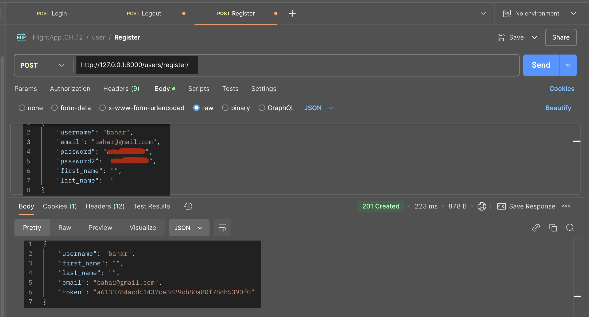

---

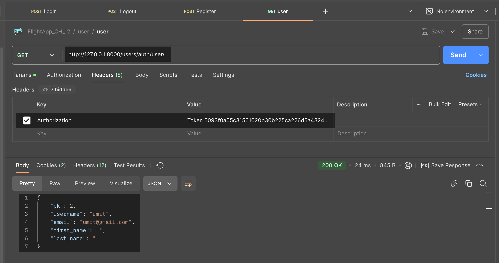

---

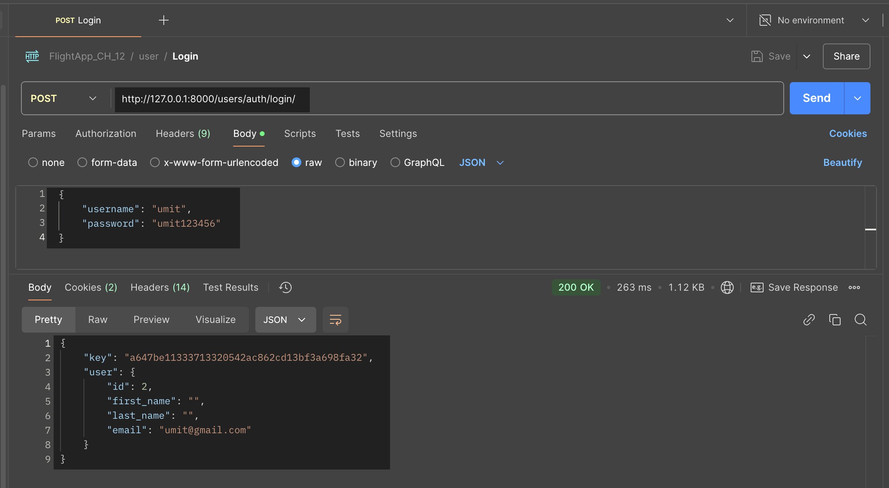

---

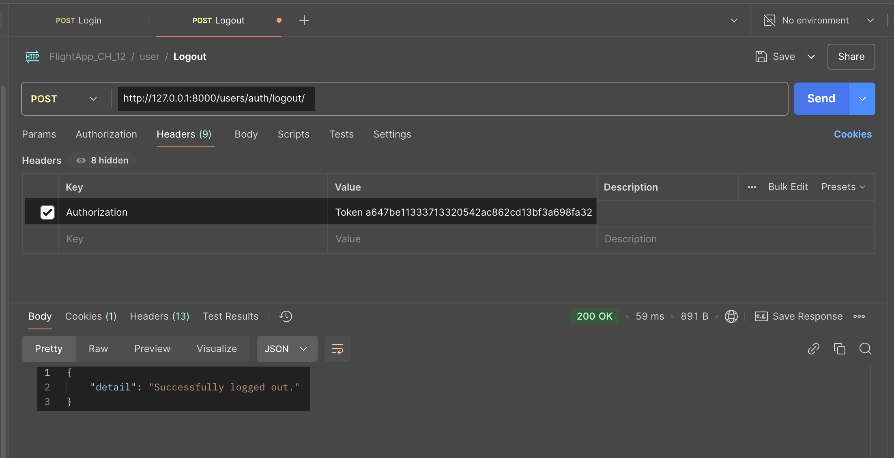

---

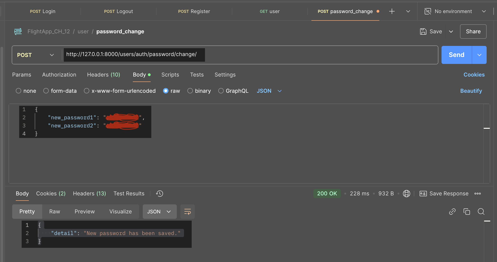

---

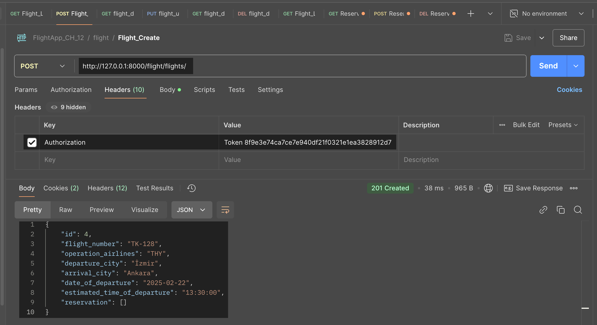

---

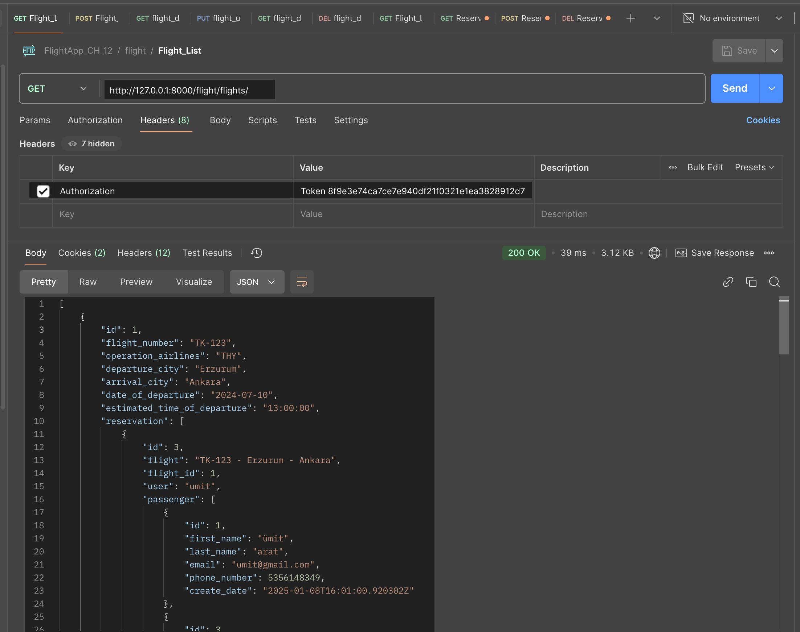

---

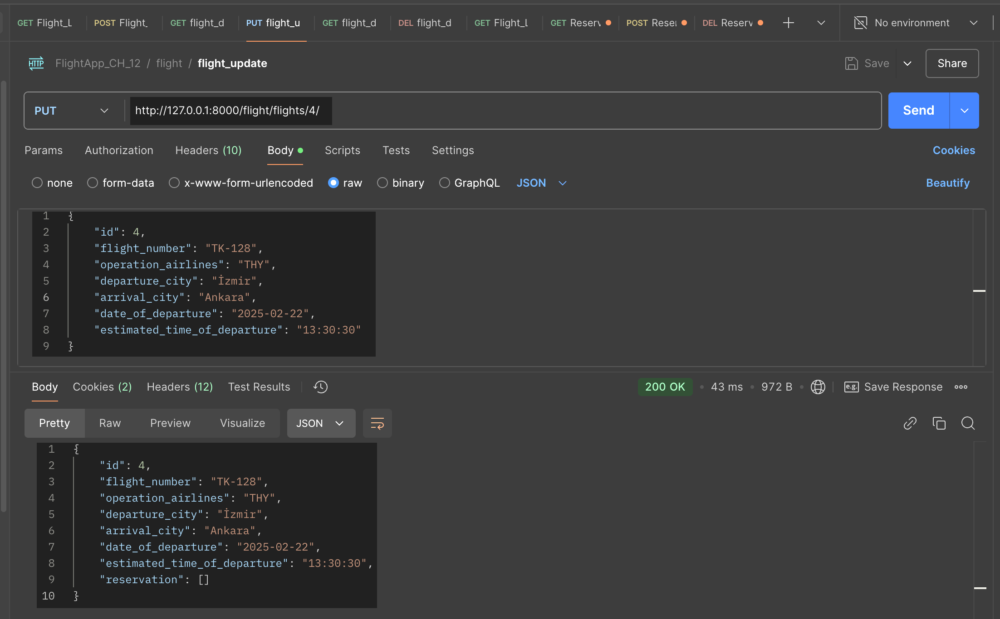

---

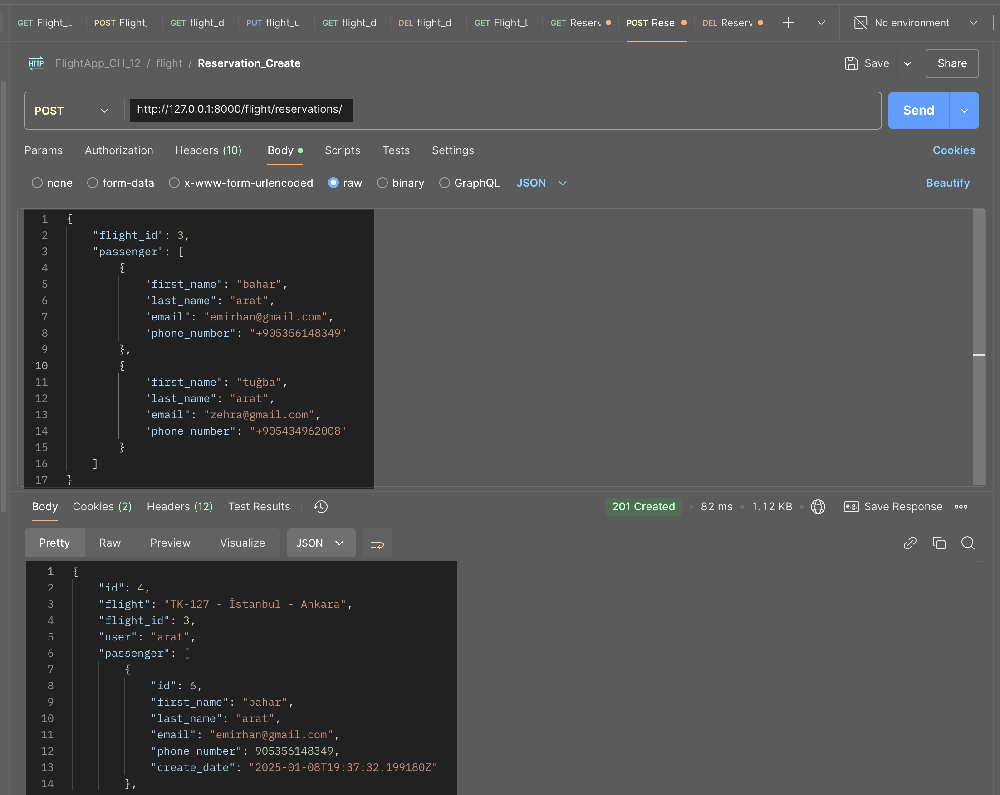

---

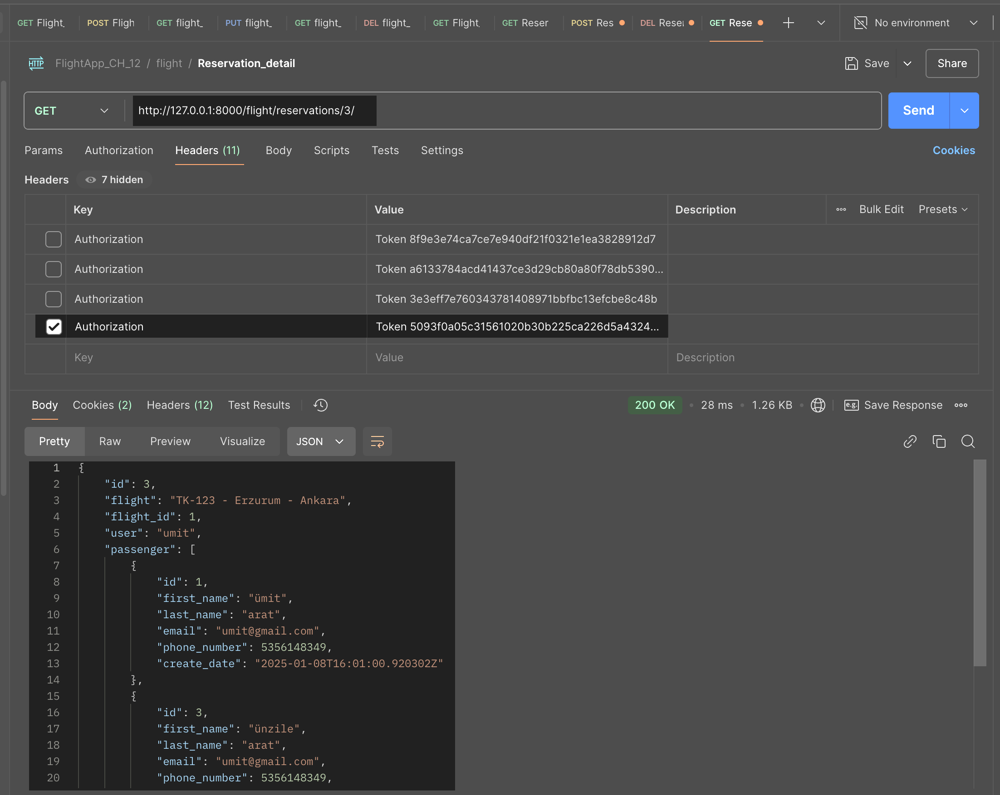

---

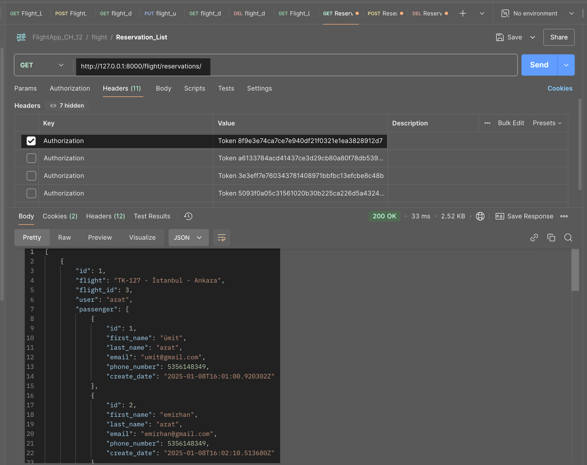

## Built With

<!-- This section should list any major frameworks that you built your project using. Here are a few examples.-->

- Djago Rest Framework
- Swagger
- Debug Toolbar
- Logging
- PostgreSQL

## How To Use

<!-- This is an example, please update according to your application -->

To clone and run this application, you'll need [Git](https://github.com/Umit8098/Proj_Django_Temp_Blog_App_CH-8) 

When installing the required packages in the requirements.txt file, review the package differences for windows/macOS/Linux environments. 

Complete the installation by uncommenting the appropriate package.

---

requirements.txt dosyasındaki gerekli paketlerin kurulumu esnasında windows/macOS/Linux ortamları için paket farklılıklarını inceleyin. 

Uygun olan paketi yorumdan kurtararak kurulumu gerçekleştirin. 

```bash
# Clone this repository
$ git clone https://github.com/Umit8098/Project_Django_Rest_Framework_Flight_App_CH-12.git

# Install dependencies
    $ python -m venv env
    $ python3.9 -m venv env (for macOs/linux OS)
    $ env/Scripts/activate (for win OS)
    $ source env/bin/activate (for macOs/linux OS)
    $ pip install -r requirements.txt
    $ python manage.py migrate (for win OS)
    $ python3 manage.py migrate (for macOs/linux OS)
# Create and Edit .env
# Add SECRET_KEY in .env file

"""
## for development(dev) environments
DEBUG =True

# for product(prod) environments
SQL_DATABASE={DB_NAME}
SQL_USER={DB_USER_NAME}
SQL_PASSWORD={DB_PASSWORD}
SQL_HOST=localhost
SQL_PORT=5432

# for choices environment
ENV_NAME =dev
# ENV_NAME =prod

DJANGO_LOG_LEVEL=INFO
"""

# Run the app
    $ python manage.py runserver
```

## About This Project
- This is a flight booking application.
- staff_users can perform CRUD (Create-Read-Update_Delete) operations for flights.
- staff_users can view reservations on all flights (including past flights) with their passengers.
- Users can anonymously view flights from the current time. 
- To create a reservation, they must register and log in to the application. 
- Users can perform CRUD (Create-Read-Update_Delete) operations on their own reservations.
- Users can change their login passwords.

<hr>

- Bu bir uçuş rezervasyon uygulamasıdır.
- staff_user'lar uçuşlar için CRUD (Create-Read-Update_Delete) işlemleri yapabilir.
- staff_user'lar tüm uçuşlardaki (geçmiş uçuşlar dahil) rezervasyonları yolcuları ile birlikte görüntüleyebilir.
- Kullanıcılar anonim olarak şimdiki zamandan sonraki uçuşları görüntüleyebilirler. 
- Rezervasyon oluşturmak için uygulamaya kayıt olup giriş yapmaları gerekir. 
- Kullanıcılar kendi rezervasyonlarında CRUD (Create-Read-Update_Delete) işlemleri yapabilir.
- Kullanıcılar giriş şifrelerini değiştirebilirler.

## Acknowledgements
- [Logging](https://docs.djangoproject.com/en/5.1/topics/logging/) - Projede kullanılan system logging modül'ü.

## Contact

<!-- - Website [your-website.com](https://{your-web-site-link}) -->
- GitHub [@Umit8098](https://github.com/Umit8098)

- Linkedin [@umit-arat](https://linkedin.com/in/umit-arat/)
<!-- - Twitter [@your-twitter](https://{twitter.com/your-username}) -->
