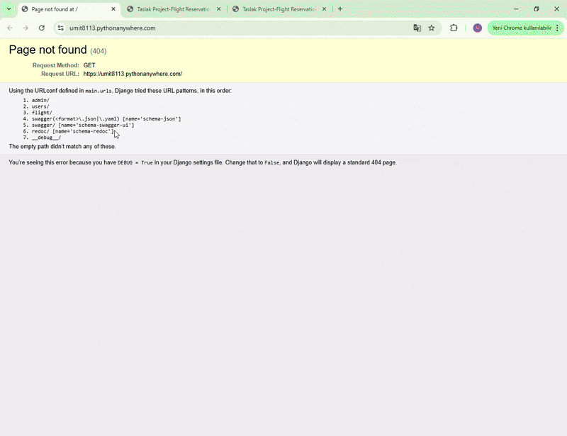

<!-- Please update value in the {}  -->

<h1 align="center">
✈️ Flight Reservation API <br/>
Django REST Framework
</h1>

<p align="center">A role-based flight booking and reservation system built with Django REST Framework.</p>

<!-- <div align="center">
  <h3>
    <a href="https://github.com/Umit8098/Project_Django_Rest_Framework_Flight_App_CH-12">
      Demo
    </a>
     | 
    <a href="https://umit8113.pythonanywhere.com/">
      Project
    </a>
 
  </h3>
</div> -->


## Overview

Flight Reservation API is a backend-focused application that enables users
to browse available flights, make reservations, and manage bookings,
while staff users can fully control flight and reservation data.

The project demonstrates role-based authorization, RESTful API design,
and production-ready backend practices using Django REST Framework.




## Table of Contents

- [Overview](#overview)
- [Table of Contents](#table-of-contents)
- [API Documentation](#api-documentation)
- [Authorization \& Permissions](#authorization--permissions)
- [Built With](#built-with)
- [How To Use](#how-to-use)
- [About This Project](#about-this-project)
- [Key Features](#key-features)
- [Contact](#contact)


## API Documentation

The API is fully documented using **Swagger** and **Redoc**.

- 🔗 Swagger UI
- 🔗 Redoc UI
- 🔗 Postman Collection

Both interfaces provide a clear overview of endpoints, request/response formats, and authorization requirements.

**Notes:** You can access Swagger and Redoc documentation without any user login.

- Along with Swagger and Redoc documentation, you can use our Postman collection to test APIs.
- 🔗 Postman Collection: [Flight Reservation API Collection](...)


## Authorization & Permissions

The application implements role-based access control:

- **Anonymous users**
  - Can view only future flights
- **Authenticated users**
  - Can create and manage their own reservations
- **Staff users**
  - Can create, update, and delete flights
  - Can view and manage all reservations

Permissions are enforced at the API level using Django REST Framework permission classes.


## Built With

- Django REST Framework – RESTful API development
- PostgreSQL – Production-grade relational database
- dj-rest-auth – Authentication & authorization
- Swagger & Redoc – API documentation
- Django Logging – Application-level logging
- Django Debug Toolbar – Development debugging


## How To Use

<!-- This is an example, please update according to your application -->

- For online demo: You can take a look at the [Swagger](https://umit8113.pythonanywhere.com/swagger/) and [Redoc](https://umit8113.pythonanywhere.com/redoc/) interfaces.

- To clone and run this application, you'll need [Git](https://github.com/Umit8098/Project_Django_Rest_Framework_Flight_App_CH-12.git) 

- When installing the required packages in the requirements.txt file, review the package differences for windows/macOS/Linux environments. 

- Adjust database and environment settings based on your OS and environment.

```bash
# Clone this repository
$ git clone https://github.com/Umit8098/Project_Django_Rest_Framework_Flight_App_CH-12.git

# Install dependencies
    $ python -m venv env
    $ source env/bin/activate 
    $ pip install -r requirements.txt
    $ python manage.py migrate

# Create and Edit .env
# Add Your SECRET_KEY in .env file

"""
# example .env;

SECRET_KEY =123456789abcdefg...

# for development(dev) environments
DEBUG =True

# PostgreSQL settings for product (product) environments
SQL_DATABASE={your_database_name}
SQL_USER={your_database_user}
SQL_PASSWORD={your_database_password}
SQL_HOST=localhost
SQL_PORT=5432

# for choices environment
ENV_NAME =dev
# ENV_NAME =prod

# Logging level
DJANGO_LOG_LEVEL=INFO
"""

# Run the app
    $ python manage.py migrate
    $ python manage.py runserver
```


## About This Project

This project focuses on building a production-ready backend API
for a flight reservation system.

It demonstrates:
- RESTful API design
- Role-based authorization
- Environment-based configuration (dev / prod)
- PostgreSQL integration for scalable data handling
- API documentation for third-party integrations


## Key Features

- **Flight Reservation Management:** Users can view and book flights.
- **Staff Authorizations:** Staff users can fully control flights and reservations.
- **API Documentation:** Detailed API documentation with Swagger and Redoc.
- **User Authorization:** Registration, login, password change and reservation management.
- **PostgreSQL Support:** High performance database in production environment.


## Contact

<!-- - Website [your-website.com](https://{your-web-site-link}) -->
- **GitHub** [@Umit8098](https://github.com/Umit8098)

- **LinkedIn** [@umit-arat](https://linkedin.com/in/umit-arat/)
<!-- - Twitter [@your-twitter](https://{twitter.com/your-username}) -->

